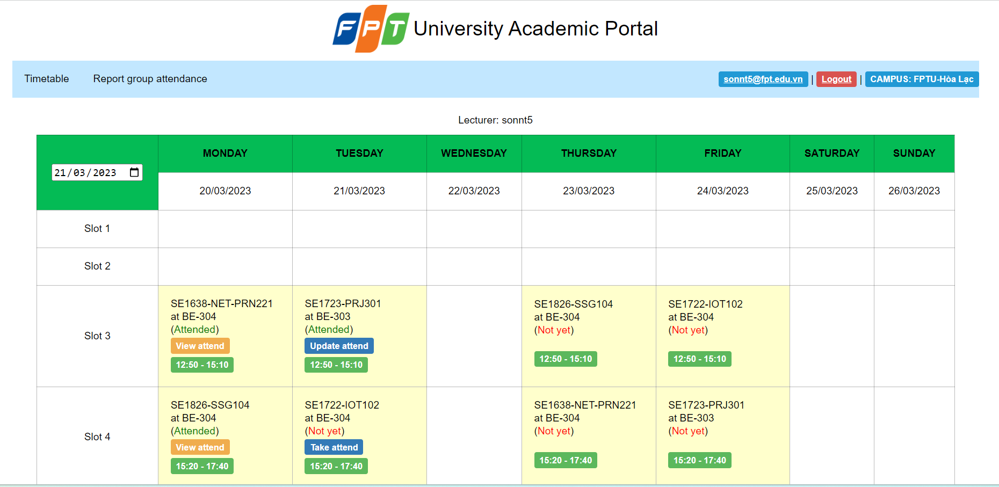
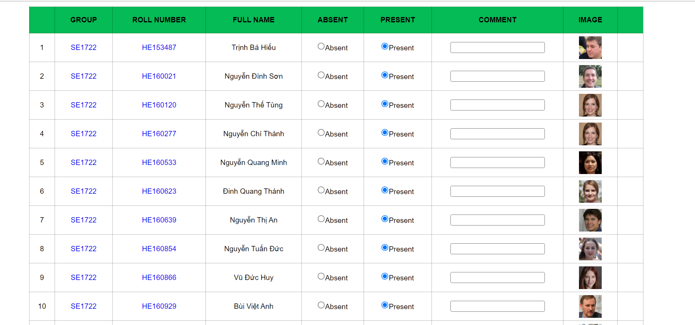
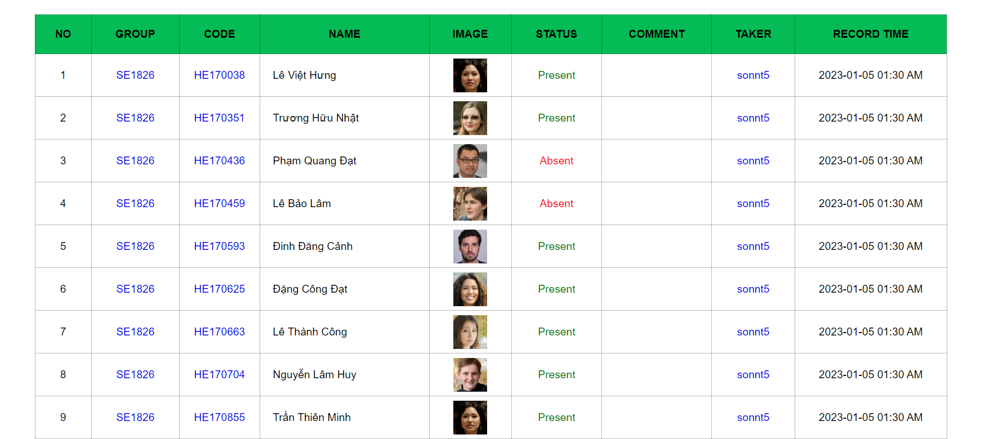
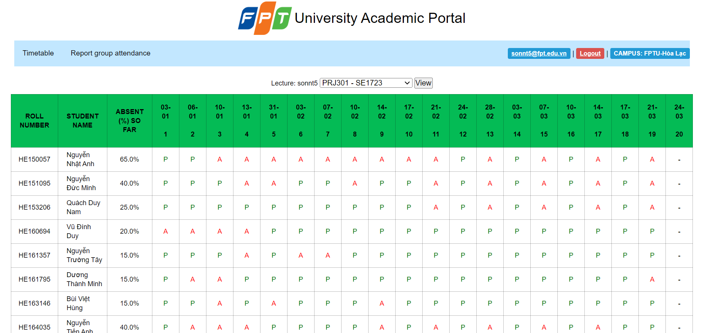
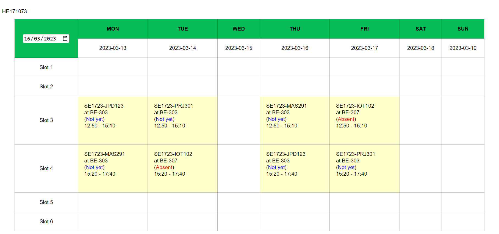
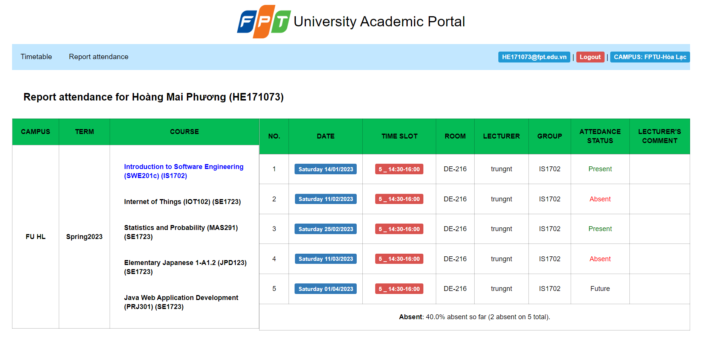

## 1. Detailed Specification

This is an individual assignment of PRJ301\
You are asked to provide a web application for *Attendance Taking System* at FPT University\
(I know, FPT already got one, but let assume we are reconstructing it).\
You can base on existing sources to develop your design including: fap.fpt.edu.vn, flm.fpt.edu.vn, ...

### Login for student and lecturer 

## Lecturer account
### Timetable of lecturer

### Lecturer takes attendance for a group 

### Lecturer views attendance of a group after taking attendance

### Report attendance of lecturer's groups 

## Student account
### Timetable of students

### Student views report attendence of their groups 

## 2. Tool
* Backend: Java JSP Servlet
* Frontend: HTML CSS 
* Database: SQL Server

#### FPTU Semester SPRING 2023 © mai.phương.hoàng |

